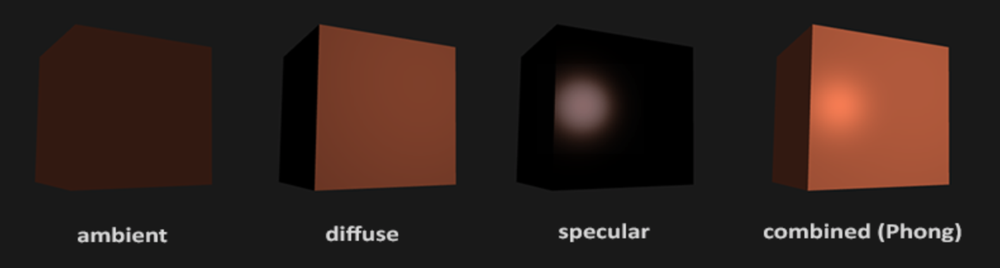
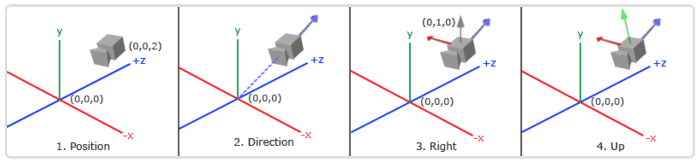

场景绘制

cubemap实现环境模拟， 使用6张图片分别是前后左右以及天空和地面分别绑定至GL\_TEXTURE\_CUBE\_MAP\_POSITIVE\_X,GL\_TEXTURE\_CUBE\_MAP\_NEGATIVE\_X,GL\_TEXTURE\_CUBE\_MAP\_POSITIVE\_Y,GL\_TEXTURE\_CUBE\_MAP\_NEGATIVE\_Y,GL\_TEXTURE\_CUBE\_MAP\_POSITIVE\_Z,GL\_TEXTURE\_CUBE\_MAP\_NEGATIVE\_Z

1. 加载图片 加载纹理
2. 创建位图文件信息和位图文件头结构 , 读入位图文件头信息
3. 检查该文件是否为位图文件, 若不是位图文件,则关闭文件并返回
4. 通过位图文件信息头，获取图像的宽度和高度
5. 读取图像数据，将图像颜色数据格式进行交换,由BGR转换为RGB

```js
FILE *pFile = 0; 
BITMAPINFOHEADER bitmapInfoHeader;
BITMAPFILEHEADER header;
unsigned char textureColors = 0;

pFile = fopen(file, "rb");
if (pFile == 0) return false;
fread(&header, sizeof(BITMAPFILEHEADER), 1, pFile);
if(header.bfType != BITMAP_ID)
{
    fclose(pFile);          
    return false;
    }
    fread(&bitmapInfoHeader, sizeof(BITMAPINFOHEADER), 1, pFile);
    imageWidth = bitmapInfoHeader.biWidth;
    imageHeight = bitmapInfoHeader.biHeight;
    if (bitmapInfoHeader.biSizeImage == 0)
    bitmapInfoHeader.biSizeImage = bitmapInfoHeader.biWidth *
    bitmapInfoHeader.biHeight * 3;
    fseek(pFile, header.bfOffBits, SEEK_SET);
    image = new unsigned char[bitmapInfoHeader.biSizeImage];
    if (!image)                        
    {
        delete[] image;
        fclose(pFile);
        return false;
    }
    fread(image, 1, bitmapInfoHeader.biSizeImage, pFile);
    for (int index = 0; index < (int)bitmapInfoHeader.biSizeImage; index += 3)
    {
        textureColors = image[index];
        image[index] = image[index + 2];
        image[index + 2] = textureColors;
    }
    fclose(pFile);      
```

对纹理进行采样，三维纹理坐标（s,t,r）

```js
glTexParameteri(GL_TEXTURE_CUBE_MAP,GL_TEXTURE_WRAP_S, GL_CLAMP_TO_EDGE);
glTexParameteri(GL_TEXTURE_CUBE_MAP,GL_TEXTURE_WRAP_T, GL_CLAMP_TO_EDGE);
glTexParameteri(GL_TEXTURE_CUBE_MAP,GL_TEXTURE_WRAP_R, GL_CLAMP_TO_EDGE);
```

首先根据（s,t,r）中模最大的分量决定在哪个面采样，然后使用剩下的2个坐标在对应的面上左2D纹理采样。其中 WRAP 参数决定纹理坐标超出(0,1)范围时的采样方式。

参数GL\_CLAMP\_TO\_EDGE用于指定当三维纹理坐标没有落在某个面，而是落在两个面之间的纹理采样，参数表明当在两个面之间采样使用边缘的纹理值。

首先创建一个立方体，作为图片载体。在6个面分别创立cubemap映射于此立方体。

一个使得场景显得非常大的技巧就是，先关闭深度缓存，绘制场景，去掉视变换中移动的部分，保留旋转等其他成分。

```js
char filename[128]; 
char *bmpName[] = { "back","front","bottom","top","left","right" };
for (int i = 0; i< 6; i++)
{
    sprintf(filename, "C:/Users/luyujie.CN/source/repos/testsky/testsky/resources/textures/skybox/%s", bmpName[i]);
    strcat(filename, ".bmp");
    if (!m_texture[i].LoadBitmap(filename))                   
    {          
      ...//载入失败
    }
        glGenTextures(1, &m_texture[i].ID);         
        glBindTexture(GL_TEXTURE_2D, m_texture[i].ID);
        glTexParameteri(GL_TEXTURE_2D, GL_TEXTURE_MIN_FILTER, GL_LINEAR_MIPMAP_NEAREST);
        glTexParameteri(GL_TEXTURE_2D, GL_TEXTURE_MAG_FILTER, GL_LINEAR);
        glTexParameteri(GL_TEXTURE_2D, GL_TEXTURE_WRAP_S, GL_CLAMP_TO_EDGE);
        glTexParameteri(GL_TEXTURE_2D, GL_TEXTURE_WRAP_T, GL_CLAMP_TO_EDGE);
        gluBuild2DMipmaps(GL_TEXTURE_2D, GL_RGB, m_texture[i].imageWidth,
                          m_texture[i].imageHeight, GL_RGB, GL_UNSIGNED_BYTE,
                          m_texture[i].image);
}
```

* bmpName存储场景图片名称
* glGenTextures(1, &m\_texture[i].ID); 分别生成场景六个面的纹理对象名称
* 控制滤波：GL\_TEXTURE\_WRAP\_S，GL\_TEXTURE\_WRAP\_T通常可设置为GL\_REPEAT或GL\_CLAMP两种方式。 当待填充的多边形大于纹理的时候，GL\_REPEAT表示多余的部分用重复的方式填充；GL\_CLAMP表示多余的部分用相连边缘的相邻像素填充。
* gluBuild2DMipmaps(GL\_TEXTURE\_2D, GL\_RGB, m\_texture[i].imageWidth, m\_texture[i].imageHeight, GL\_RGB, GL\_UNSIGNED\_BYTE, m\_texture[i].image);创建纹理

需要改进的部分，即使在缝隙处已经尽量做到连续，效果呈现还算真实，但是天空的绘制不尽如人意，后继希望采用球体来模拟天空，赋予特殊材质，并添加云朵移动的效果，使得场景更加真实。

光源

采用简化光照模型（冯氏光照模型），主要结构由3个分量组成：环境（Ambient），漫反射（Diffuse）和镜面（Specular）光照。



***图参考LearnOpenGL网站***

* 环境光照(Ambient Lighting)：即使在黑暗的情况下，世界上通常也仍然有一些光亮（月亮、远处的光），所以物体几乎永远不会是完全黑暗的。为了模拟这个，我们会使用一个环境光照常量，它永远会给物体一些颜色。
* 漫反射光照(Diffuse Lighting)：模拟光源对物体的方向性影响(Directional Impact)。它是冯氏光照模型中视觉上最显著的分量。物体的某一部分越是正对着光源，它就会越亮。
* 镜面光照(Specular Lighting)：模拟有光泽物体上面出现的亮点。镜面光照的颜色相比于物体的颜色会更倾向于光的颜色。

模拟三种光照分量实现如下：

```js
GLfloat light_position[] = { 1.0, 14.0, 0.0, 1.0 };//光源位置坐标
GLfloat light_ambient[] = { 0.8, 0.5, 0.0, 1.0 };//环境光
GLfloat light_diffuse[] = { 1.0, 1.0, 1.0, 1.0 };//漫反射光
GLfloat light_specular[] = { 0.0, 1.0, 1.0, 1.0 };//镜面光
```

* 第一行表示位置坐标，最后一个参数为0，说明是方向性的光源（不考虑衰减），非0则为位置性光源（考虑衰减）
* 第二行表示环境光
* 第三行表示漫反射光
* 第四行表示镜面光
  * 镜面亮点 ：镜面光照和材料属性可以为物体表面添加光泽和亮斑的效果，当入射光与观察者的角度较小时，可以看到镜面加亮的效果。镜面亮点是几乎所有的光照射在物体表面上并被反射开来。

给材料添加镜面反射属性 ：

```js
GLfloat specref[] = {1.0f, 1.0f, 1.0f, 1.0f};
glEnable(GL_COLOR_MATERIAL);
 glColorglColorMaterial(GL_FRONT, GL_AMBIENT_AND_DIFFUSE);
glMaterialfv(GL_FRONT, GL_SPECULAR, specref);
glMateriali(GL_FRONT, GL_SHININESS, 128);
```

代码在设置镜面反射属性之前，为材料的环境光和漫反射光属性开启颜色追踪。材料的镜面光反射属性我们另外单独指定了一个固定不变的值。指定材料的镜面光反射属性为(1.0f, 1.0f, 1.0f, 1.0f)代表着完全发射入射的镜面光。在glMaterialfv(GL\_FRONT, GL\_SPECULAR, specref)；之后的多边形将采用此材料属性

```js
glEnable(GL_LIGHTING);
glEnable(GL_LIGHT1);
glLightfv(GL_LIGHT1, GL_POSITION, light_position);
glLightfv(GL_LIGHT1, GL_AMBIENT , light_ambient );
glLightfv(GL_LIGHT1, GL_DIFFUSE , light_diffuse );
glLightfv(GL_LIGHT1, GL_SPECULAR, light_specular);
```

* 第一行， GL\_LIGHTING 启用灯源
* GL\_LIGHT0 ~ GL\_LIGHT7 表示启用0号灯到7号灯（光源），由glLight函数完成光源要求
* 第三行设置光的初始位置
* 第四行设置光的环境强度
* 第五行设置散射光
* 第六行设置镜面光

相机漫游

以摄像机的视角作为场景原点时场景中所有的顶点坐标：观察矩阵把所有的世界坐标变换为相对于摄像机位置与方向的观察坐标。定义摄像机在世界空间中的位置、观察的方向、一个指向它右测的向量以及一个指向它上方的向量。



***图参考LearnOpenGL学习网站***

1. 获取摄像机位置（世界坐标系下指向摄像机位置的向量）
2. 摄像机的指向方向。场景原点向量减去摄像机位置向量的结果就是摄像机的指向向量
3. 右向量（摄像机空间的x轴的正方向），先定义一个上向量，再把上向量和方向向量进行叉乘，此时得到的方向为指向x轴正方向的向量
4. 右向量和方向向量进行叉乘得到指向摄像机正y轴向量

```js
	Vector3 afterRotateView;
	Vector3 beforeRotateView = viewDirection - positionDirection;
	float cosTheta = (float)cos(angle);
	float sinTheta = (float)sin(angle);

	afterRotateView.x = (cosTheta + (1 - cosTheta) * x * x)        * beforeRotateView.x;
	afterRotateView.x += ((1 - cosTheta) * x * y - z * sinTheta)    * beforeRotateView.y;
	afterRotateView.x += ((1 - cosTheta) * x * z + y * sinTheta)    * beforeRotateView.z;

	afterRotateView.y = ((1 - cosTheta) * x * y + z * sinTheta)    * beforeRotateView.x;
	afterRotateView.y += (cosTheta + (1 - cosTheta) * y * y)        * beforeRotateView.y;
	afterRotateView.y += ((1 - cosTheta) * y * z - x * sinTheta)    * beforeRotateView.z;

	afterRotateView.z = ((1 - cosTheta) * x * z - y * sinTheta)    * beforeRotateView.x;
	afterRotateView.z += ((1 - cosTheta) * y * z + x * sinTheta)    * beforeRotateView.y;
	afterRotateView.z += (cosTheta + (1 - cosTheta) * z * z)        * beforeRotateView.z;

	viewDirection = positionDirection + afterRotateView;
```

1. 计算旋转方向向量的x分量值
2. 计算旋转方向向量的y分量值
3. 计算旋转方向向量的z分量值

* 摄像机的移动速度

1. 通过前后帧的时间，计算时间差再乘以一个常量来计算速度

* 键盘控制分量的增减

```js
case 101:
  m_Camera.moveCamera(-m_Camera.getSpeed());
  break;
case 97:
  m_Camera.yawCamera(-m_Camera.getSpeed());
  break;
case 100:
  m_Camera.yawCamera(m_Camera.getSpeed());
  break;
case 119:
  m_Camera.goCamera(m_Camera.getSpeed());
  break;
case 115:
  m_Camera.goCamera(-m_Camera.getSpeed());
  break;
```

* 鼠标控制摄像机

欧拉角(Euler Angle)是可以表示3D空间中任何旋转的3个值，由莱昂哈德·欧拉(Leonhard Euler)在18世纪提出。一共有3种欧拉角：俯仰角(Pitch)、偏航角(Yaw)和滚转角(Roll)，下面的图片展示了它们的含义：


***图参考自LearnOpenGL***

我们的工程具体实现步骤如下：

1. 首先获得屏幕的宽度和高度，并设置其中点作为坐标中心
2. 需要计算摄像机左右旋转角度以及上下旋转角度
3. 获得鼠标当前的位置，与鼠标原始点进行比较，如果没有移动视野无需更改，如果移动，视野需要根据鼠标的更新移动更改绘制视野
4. 通过叉积计算与旋转方向垂直的向量

通过叉积找到与旋转方向垂直的向量

```js
			Vector3 vAxis = m_View - m_Position;
			vAxis = vAxis.crossProduct(m_UpVector);
			vAxis = vAxis.normalize();
```

x分量取决于cos(yaw)的值，z值同样取决于偏航角的正弦值。把这个加到前面的值中，会得到基于俯仰角和偏航角的方向向量。


